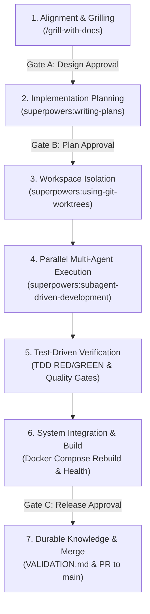

# AI Engineering Team Guidelines & SDLC Lifecycle

## Purpose & Scope

This document defines the **AI Multi-Agent Engineering Lifecycle (AI SDLC Engineering Loop)** for the Cloud Team Management platform. It standardizes how human engineers and autonomous AI agents collaborate as a cohesive, controlled engineering team to deliver production-grade software with verifiable evidence.

---

## 1. Team Roles & Accountabilities

```
┌─────────────────────────────────────────────────────────────────────────────┐
│                       AI Engineering Team RACI Matrix                       │
├───────────────────┬─────────────────────────────────────────────────────────┤
│ Role              │ Responsibilities & Authority Scope                      │
├───────────────────┼─────────────────────────────────────────────────────────┤
│ Human Owner       │ • Accountable owner of intent, scope, and priorities.   │
│ (Accountable)     │ • Explicit approvals required for Gates A, B, and C.    │
│                   │ • Authority over production deployment and migrations.  │
├───────────────────┼─────────────────────────────────────────────────────────┤
│ Root Orchestrator │ • Lead analyst, system architect, and delivery lead.    │
│ (Consulted / Lead)│ • Orchestrates planning, domain modeling, and ADRs.     │
│                   │ • Dispatches and coordinates specialist subagents.      │
│                   │ • Enforces quality gates and adjudicates code reviews.  │
├───────────────────┼─────────────────────────────────────────────────────────┤
│ Specialist Agents │ • Backend Engineer: Prisma, Express APIs, auth & guards. │
│ (Responsible)     │ • Frontend Logic: Pure client calculations & unit tests.│
│                   │ • Frontend UI: React 19 SPA, Tailwind components, modals│
│                   │ • Test & Security Auditor: Quality gates & compliance.  │
└───────────────────┴─────────────────────────────────────────────────────────┘
```

---

## 2. The 7-Stage AI SDLC Engineering Loop

Every non-trivial feature or refactoring follows this closed loop:



### Stage 1: Alignment & Grilling (`/grill-with-docs`)
- **Action:** Relentless interactive interview to explore the design tree and surface trade-offs.
- **Artifacts:**
  - Ubiquitous language recorded in [`CONTEXT.md`](./CONTEXT.md).
  - Architecture decisions recorded in [`docs/adr/`](./docs/adr/) (sequential numbering, e.g. `0003-auditor-role.md`).
- **Gate A (Human Design Approval):** Human owner confirms shared understanding before coding begins.

### Stage 2: Implementation Planning (`superpowers:writing-plans`)
- **Action:** Author a granular, testable implementation plan broken into decoupled tasks.
- **Standard:** Every task lists modified/created files, exact commands, TDD steps, and commit messages.
- **Location:** Saved in `docs/superpowers/plans/YYYY-MM-DD-<slug>.md`.
- **Gate B (Plan Approval):** Human partner approves task breakdown.

### Stage 3: Workspace Isolation (`superpowers:using-git-worktrees`)
- **Action:** Establish an isolated Git worktree on a dedicated branch (`feat/<name>`).
- **Safety Verification:** Ensure `.worktrees/` is git-ignored. Verify clean test baseline before writing code (all API and Web tests pass 100%).
- **Rule:** Never develop directly on `main` for non-trivial tasks.

### Stage 4: Parallel Multi-Agent Execution (`superpowers:subagent-driven-development`)
- **Action:** Root Orchestrator dispatches specialized subagents concurrently across decoupled functional boundaries:
  - *Agent 1 (Backend Core):* Prisma schema, DB migrations, seed scripts.
  - *Agent 2 (Frontend Pure Logic):* Pure helper functions, type declarations, unit tests.
  - *Agent 3 (Frontend UI Features):* React views, modals, forms, previewers.
  - *Agent 4 (Cross-Cutting Views):* Central dashboards, navigation, role-based controls.
- **Concurrency Rule:** Subagents must have clear file ownership to prevent merge conflicts.

### Stage 5: Test-Driven Verification (TDD & Quality Gates)
- **TDD Requirement:** Write failing tests first (RED), implement the minimal code to pass (GREEN), then refactor.
- **Gate 1 (Spec Compliance):** Code satisfies the exact requirements of the task brief with zero spec creep.
- **Gate 2 (Code Quality & Ponytail Simplicity):** Clean, minimal diffs; no dead code, speculative abstractions, or unnecessary dependencies.
- **Gate 3 (Security & Compliance):** Enforce Segregation of Duties (SoD), role-based middleware guards, and input sanitization.

### Stage 6: System Integration & Live Verification
- **Action:** Full test suite execution across all modules:
  - API Integration: `DATABASE_URL=... npm --prefix api test`
  - Web Unit Tests: `npm --prefix web test`
  - TypeScript Production Compiles: `npm --prefix api run build` && `npm --prefix web run build`
- **Docker Compose Live Reload:** Run `docker compose up -d --build` to verify container health, startup migrations, and proxy routing.

### Stage 7: Durable Knowledge & Evidence Handoff
- **Action:**
  - Record full test outputs and operational verification in `VALIDATION.md`.
  - Update `CONTEXT.md` and durable documentation if terms evolved.
  - Merge the feature branch into `main` cleanly and remove the temporary worktree.
- **Gate C (Human Release Acceptance):** Deliver concise evidence-backed report to the human owner.

---

## 3. Core Operating Principles

1. **Inspect before modifying:** Always inspect existing repository patterns, schema, and tests before writing new code.
2. **Ponytail Simplicity:** Prefer the simplest design that satisfies requirements. Reject speculative abstractions, redundant frameworks, and premature optimizations.
3. **Evidence over assertion:** Never declare completion without automated test logs, build status, and container health evidence.
4. **Protect evidence & secrets:** Never commit credentials, `.env` secrets, or tokens. Ensure audit evidence is immutable and protected by role-based guards.
